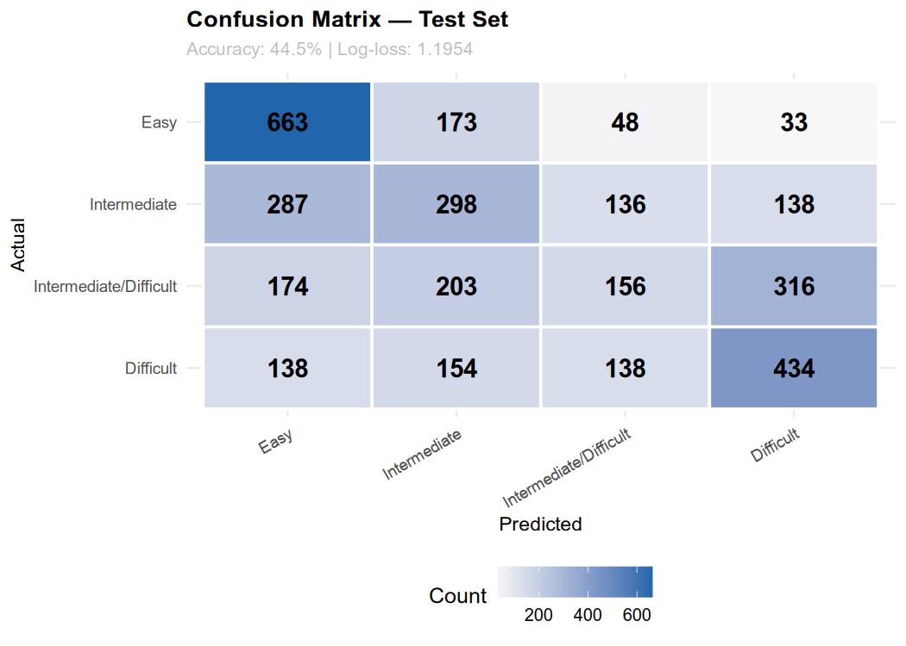

# [DS4420 Michael Mehall & Paolo Lanaro ML2 Final Project](https://github.com/mehallhm/drunk-cherry)
> Machine Learning project leveraging CNNs and Bayesian multi-class classification to classify difficulty of bike trails

In this project we've worked on building two machine learning models for classifying difficulties of bike trails.
The first model is a simple MLP that defaults to an input dimension of 100

The second model is a convolutional neural network that takes in visualized bike trail GPS data and predicts whether that trail falls into one of four categories: [Easy, Intermediate, Intermediate Difficult, Difficult]

Our last model uses Bayesian multi-class classification with the following four trail id constant features to make predictions: [`elevation_loss`, `elevation_gain`, `average_grade`, `max_grade`]

## Findings
[Spreadsheet with grid search findings (accessible via Husky google account)](https://docs.google.com/spreadsheets/d/1wKCymOrajJVm5JHa0_zLh-FwxfEtSBBgnNC8hz6487o/edit?usp=sharing)

## Usage Examples
- You'll need to unzip the `all_trails.zip` file to use the `all_trails.csv` file in this project. We don't directly include the `.csv` in this project because the dataset is large

* Please remember to `pip install -r requirements.txt` before trying any of the following commands

### MLP Usage (Python):
1. Change directory to `./src/mlp`
2. Run `python train.py --input <path_to_zip>` with the path to the zip and any other arguments you'd like

### CNN Usage (Python):
- Within this repository there should be a pretrained model at `./src/models/cnn/best_model.keras`. This can be [loaded](https://www.tensorflow.org/tutorials/keras/save_and_load#new_high-level_keras_format) with `keras.model.load_model("./src/models/cnn/best_model.keras")`

Note: If you'd like to train a new model using our framework you have to first generate images from the csv using the script located at `./src/scripts/image_gen.py`
1. You'll be able to pass in a couple parameters to vary the output of the trail to image generation so make sure you read the purpose of those parameters
2. To train the CNN model on the images you've created in the step above, first change directory to the `./src` directory and then run the following command:
    - `python -m cnn.train --input <generated_image_directory> --epochs <num_epochs> --output <./models/foo.keras> --csv_path <../all_trails.csv> --color <rgb or gray> --balance undersample`
3. This should train the model over the number of epochs specified, saving checkpointed best models during training

### Bayesian Model Usage (R):
1. To run the training for the model, run the R program and tune the hyperparameters at the top of the file as needed.
2. Extract point estimate weights from the `./src/models/bayesian/` directory.
